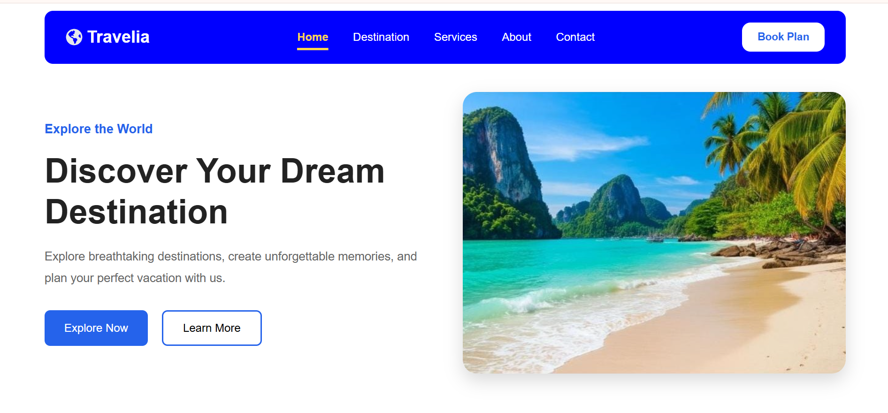
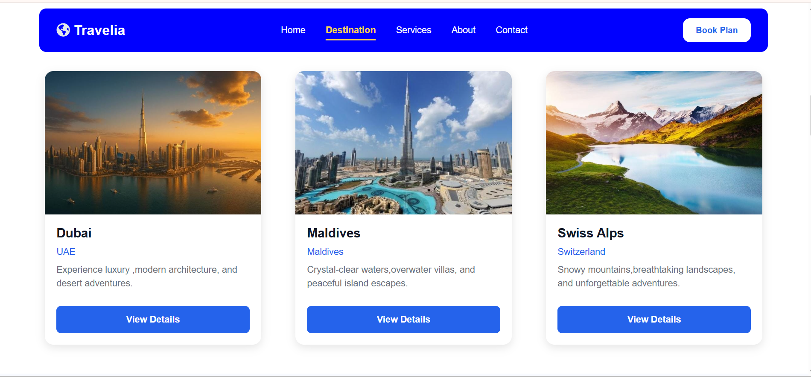
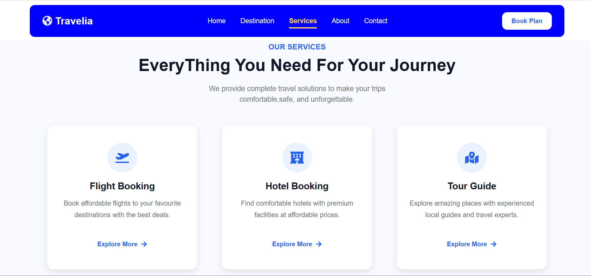
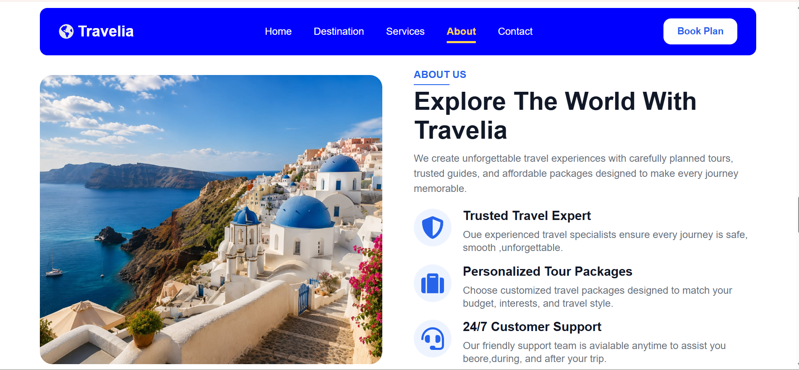
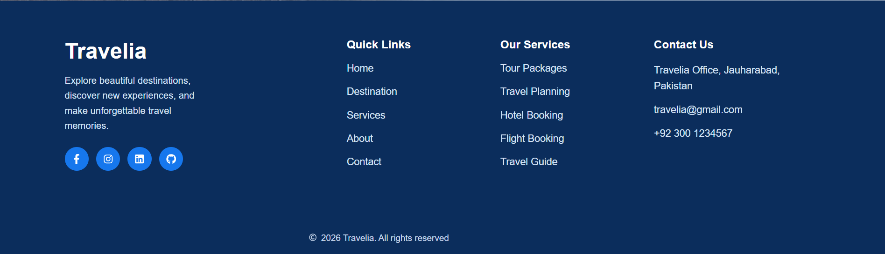

# 🌍 Travelia - Responsive Travel Website

A modern and fully responsive **Travel & Tourism Website** built with **React.js** and **Vite**. This project was developed to practice React fundamentals, reusable components, props, component composition, and responsive web design while creating a clean and professional user interface.

---

## 📖 Overview

Travelia is a static travel website designed to provide users with an engaging travel experience. It showcases popular destinations, travel services, company information, and a modern contact section.

The project emphasizes clean code, reusable React components, organized project structure, and responsive design without using any backend or external APIs.

---

## ✨ Features

- Responsive Navigation Bar
- Modern Hero Section
- Popular Destinations Section
- Travel Services Section
- About Us Section
- Contact Section with Contact Form
- Contact Information Cards
- Professional Footer
- Fully Responsive Design
- Reusable React Components
- Dynamic Rendering using Props and `.map()`
- Clean Folder Structure
- Modern UI with Custom CSS

---

## 🛠️ Built With

- React.js
- Vite
- JavaScript (ES6+)
- JSX
- CSS3
- React Icons

---

## ⚛️ React Concepts Practiced

- Functional Components
- Component-Based Architecture
- Reusable Components
- Props
- Props Destructuring
- Dynamic Rendering using `.map()`
- External Data Files
- Responsive Design
- React Icons Integration

---

## 📂 Folder Structure

```text
src
│
├── assets
│
├── components
│   ├── Navbar
│   ├── Hero
│   ├── Destination
│   ├── Services
│   ├── About
│   ├── Contact
│   └── Footer
│
├── data
│   ├── destination.js
│   └── services.js
│
├── App.jsx
├── main.jsx
└── index.css
```

---

## 📱 Responsive Design

The website is optimized for:

- Desktop
- Tablet
- Mobile Devices

---

## 🚀 Getting Started

### Clone the repository

```bash
git clone https://github.com/your-username/travelia.git
```

### Navigate to the project

```bash
cd travelia
```

### Install dependencies

```bash
npm install
```

### Start development server

```bash
npm run dev
```

### Build for production

```bash
npm run build
```

---

## 🎯 Learning Outcomes

This project helped strengthen my understanding of:

- React Fundamentals
- Component Reusability
- Props Passing
- JSX
- Responsive Web Design
- Project Organization
- Modern UI Development
- Clean Folder Structure

---

## 📸 Screenshots
Home Page

Destination Section

Services Section

About Section

Footer Section



---

## 🌐 Live Demo

**Vercel Deployment**

https://react-travelia-website-blue.vercel.app

---

## 💻 Author

**Tahira Batool**

BS Computer Science Student

Aspiring Full Stack Web Developer

---

## 📄 License

This project is developed for educational and learning purposes.